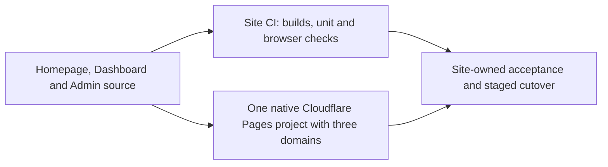

# Respire Frontends

Frontend source ownership for the Respire product website, Dashboard and Admin. API services live in `risense-ai/respire-server`.

| Destination | URL |
| --- | --- |
| Website | https://rsrs.rs |
| Account dashboard | https://dash.rsrs.rs |
| Administration | https://admin.rsrs.rs |
| API | https://api.rsrs.rs |



## Build

```sh
cd homepage
npm ci
npm run check
npm test
npm run build
npm run build:dev
```

Production files are written to `site/dist/client/`; preview files to `site/dist/preview/`. English is the default language, with Chinese at `/zh/`. The preview uses `/preview/` and links to the development dashboard and administration routes.

See [homepage documentation](homepage/README.md) for browser checks, motion controls and configuration. Preserve [third-party notices](THIRD_PARTY_NOTICES.md) and the vendored CSS license with the source.

## Dashboard and Admin

The shared [`console/`](console/README.md) React codebase builds one bundle for Dashboard and Admin. `scripts/assemble-pages.mjs` combines this bundle with the homepage into one Pages deployment: the project root serves the website, while the configured Dashboard and Admin hostnames select their surface from the same console code. See [the Pages configuration and staged API-first cutover](console/CLOUDFLARE-PAGES.md).

Frontend source moves now; existing runtime routes and containers remain until API deployment, Pages verification and separately authorized traffic migration have finished.

## Checks and deployment

Pushes to `develop` automatically deploy the DEV Pages project. After DEV
verification and the existing Site CI pass, merge `develop` into `main` to
automatically deploy production. Both projects use native Cloudflare Pages Git
integration; tags do not trigger deployment. No Cloudflare deployment token or
backend server configuration is stored in this repository. Backend/database
deployment remains operator-local SSH.

[Site CI](.github/workflows/ci.yml) owns build, unit and local browser checks for all three frontends, including the homepage production and development distributions. Linux jobs run the full local browser suites; a Windows clean-checkout console job verifies source, units, builds and provenance with line-ending conversion enabled. Native Cloudflare Pages Git integration builds one combined deployment from its Site revision; see [the project configuration](console/CLOUDFLARE-PAGES.md). Separately approved, isolated hosted acceptance also lives in Site and is never run by ordinary CI or Pages builds.

Keep the rollout order: deploy and validate the API, verify Pages with exact Server/Site provenance, then migrate traffic only with separate approval. The [downstream CLI transition](console/CLOUDFLARE-PAGES.md#downstream-cli-acceptance-boundary) removes frontend fetching and browser gates from CLI acceptance; CLI retains its API acceptance and mail helper.

## CLI

```sh
npm i -g @rsrsai/cli
# or
pnpm add -g @rsrsai/cli
rsrs doctor
rsrs --help
rsrs recall "query" --titles --json
```

## License

First-party material uses the [Respire Noncommercial License 1.0](LICENSE).
Personal noncommercial use and self-hosting are permitted. Commercial use,
including internal business deployment, requires prior written authorization.
See [commercial licensing](COMMERCIAL-LICENSE.md).
